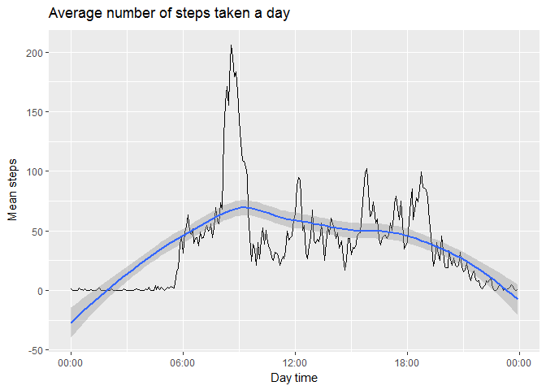
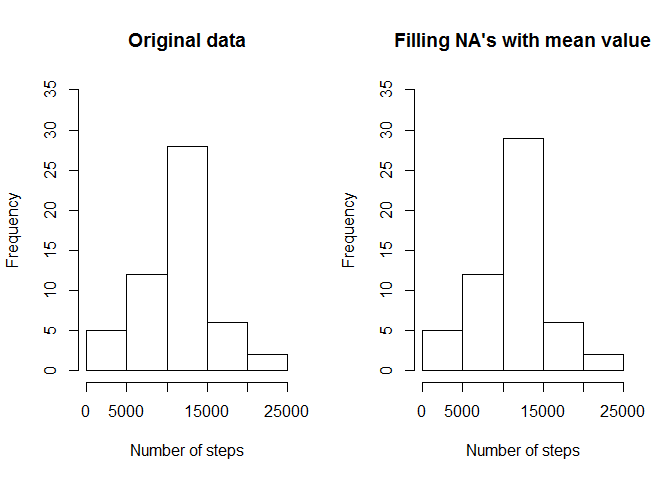
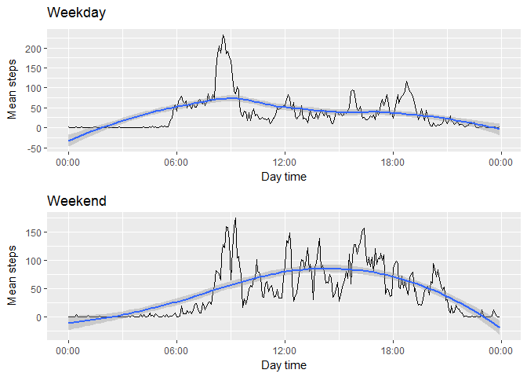

# Reproducible Research: Peer Assessment 1

## Loading and preprocessing the data

First, read the data from a .csv file:

```r
library(data.table)

dt <- read.table("activity.csv", sep = ",", skip=1)
nms <- read.table("activity.csv", nrows = 1, sep = ",");
names(dt) <- lapply(nms[1, ], as.character);
```

The $date field has a factor format, change it to Date format:

```r
dt$date <- as.Date(dt$date, "%Y-%m-%d")
summary(dt)
```

```
##      steps             date               interval     
##  Min.   :  0.00   Min.   :2012-10-01   Min.   :   0.0  
##  1st Qu.:  0.00   1st Qu.:2012-10-16   1st Qu.: 588.8  
##  Median :  0.00   Median :2012-10-31   Median :1177.5  
##  Mean   : 37.38   Mean   :2012-10-31   Mean   :1177.5  
##  3rd Qu.: 12.00   3rd Qu.:2012-11-15   3rd Qu.:1766.2  
##  Max.   :806.00   Max.   :2012-11-30   Max.   :2355.0  
##  NA's   :2304
```

## What is mean total number of steps taken per day?

First, let see the data:

```r
stepsByDate <- aggregate(steps~date, dt, sum)

head(stepsByDate)
```

```
##         date steps
## 1 2012-10-02   126
## 2 2012-10-03 11352
## 3 2012-10-04 12116
## 4 2012-10-05 13294
## 5 2012-10-06 15420
## 6 2012-10-07 11015
```

Then, let see the distribution of total number of steps each day at histogram:

```r
hist(stepsByDate$steps, main = "Total number of steps taken each day", xlab = "Number of steps")
```

<!-- -->

The mean value of steps each date is **10766.19**, corresponding median value is **10765**

## What is the average daily activity pattern?

Make a new dataset represented mean steps by time interval

```r
stepsByInt <- aggregate(steps~interval, dt, mean)

head(stepsByInt)
```

```
##   interval     steps
## 1        0 1.7169811
## 2        5 0.3396226
## 3       10 0.1320755
## 4       15 0.1509434
## 5       20 0.0754717
## 6       25 2.0943396
```
Interval values may be transform into datetime values:

```r
h <-floor(stepsByInt$interval/100)
m <-stepsByInt$interval%%100
stepsByInt$time <- as.POSIXlt(h*60*60+m*60,origin = "2012-10-01", tz = "UTC")

head(stepsByInt$time)
```

```
## [1] "2012-10-01 00:00:00 UTC" "2012-10-01 00:05:00 UTC"
## [3] "2012-10-01 00:10:00 UTC" "2012-10-01 00:15:00 UTC"
## [5] "2012-10-01 00:20:00 UTC" "2012-10-01 00:25:00 UTC"
```

Let see the average number of steps taken a day. We'll use ggplot2 library to plot the data:

```r
library(ggplot2)

ggplot(stepsByInt, aes(time, steps))+geom_line()+geom_smooth(method = 'loess')+scale_x_datetime(date_labels = "%H:%M")+
  labs(x="Day time", y=expression("Mean steps")) + 
  labs(title=expression("Average number of steps taken a day"))
```

<!-- -->

Following the output data, the maximum number of steps across all the days is:

```r
stepsByInt[which.max(stepsByInt$steps),1:3]
```

```
##     interval    steps                time
## 104      835 206.1698 2012-10-01 08:35:00
```

The maximum number of steps **206.17** we have at **08:35**, which is correspond to time when all people go to work or do their morning activities.

## Imputing missing values

The dataset has a number of days/intervals where there are missing values(coded as NA).
To calculate the total number of missing values use following code:


```r
sum(is.na(dt$steps))
```

```
## [1] 2304
```

Due to high fluctuations of number of steps during the day, we can not use mean value of steps a day for filling all missing values. It seems better to use mean value for the interval.
Make a copy of the original dataset and replace each NA steps value with mean value:

```r
#Make a copy of the original dataset
dtmp <- dt;

for (i in 1:nrow(dt)){
  dtmp$steps <- ifelse (is.na(dt$steps) == TRUE , stepsByInt[stepsByInt$interval==dt$interval, 2], dt$steps)
}
```

Let see the difference in new dataset:

```r
stepsByDate_tmp <- aggregate(steps~date, dtmp, sum)
par(mfrow=c(1,2))
hist(stepsByDate$steps, main = "Original data", xlab = "Number of steps", ylim = c(0,35))
hist(stepsByDate_tmp$steps, main = "Filling NA's with mean value", xlab = "Number of steps", ylim = c(0,35))
```

<!-- -->

The corresponding new mean value of number of steps is **10766.19**, the same mean value for the original dataset **10766.19**. But, the median value for original dataset is **10765**, the corresponding value for new data set with filling NA's is **10765.59**
So, we can conclude that the impact of imputing missing data leads to the same mean value for the dataset, but changes the median value.

## Are there differences in activity patterns between weekdays and weekends?

First, create a new  variable in the dataset with two levels – “weekday” and “weekend” indicating whether a given date is a weekday or weekend day. Use package *chron* and function *is.weekend()*, the result is a column of boolean, TRUE when the date is in weekend (better to manipulate booleans here than strings):

```r
library(chron)
dtmp$weekday<-factor(is.weekend(dtmp$date), levels = c(TRUE, FALSE), labels = c("WeekEnd", "WeekDay"))
```

Make a new datasets with mean value by intervals for weekdays and weekends:

```r
stepsByInt_wd <- aggregate(steps~interval, dtmp[dtmp$weekday == "WeekDay",], mean, na.rm = T)
stepsByInt_we <- aggregate(steps~interval, dtmp[dtmp$weekday == "WeekEnd",], mean, na.rm = T)

h <-floor(stepsByInt_wd$interval/100)
m <-stepsByInt_wd$interval%%100
stepsByInt_wd$time <- as.POSIXlt(h*60*60+m*60,origin = "2012-10-01", tz = "UTC")

h <-floor(stepsByInt_we$interval/100)
m <-stepsByInt_we$interval%%100
stepsByInt_we$time <- as.POSIXlt(h*60*60+m*60,origin = "2012-10-01", tz = "UTC")
```

The easy way is to plot two plots use the *multiplot* function, defined at [www.cookbook-r.com](http://www.cookbook-r.com/)

```r
# Multiple plot function
#
# ggplot objects can be passed in ..., or to plotlist (as a list of ggplot objects)
# - cols:   Number of columns in layout
# - layout: A matrix specifying the layout. If present, 'cols' is ignored.
#
# If the layout is something like matrix(c(1,2,3,3), nrow=2, byrow=TRUE),
# then plot 1 will go in the upper left, 2 will go in the upper right, and
# 3 will go all the way across the bottom.
#
multiplot <- function(..., plotlist=NULL, file, cols=1, layout=NULL) {
  library(grid)

  # Make a list from the ... arguments and plotlist
  plots <- c(list(...), plotlist)

  numPlots = length(plots)

  # If layout is NULL, then use 'cols' to determine layout
  if (is.null(layout)) {
    # Make the panel
    # ncol: Number of columns of plots
    # nrow: Number of rows needed, calculated from # of cols
    layout <- matrix(seq(1, cols * ceiling(numPlots/cols)),
                    ncol = cols, nrow = ceiling(numPlots/cols))
  }

 if (numPlots==1) {
    print(plots[[1]])

  } else {
    # Set up the page
    grid.newpage()
    pushViewport(viewport(layout = grid.layout(nrow(layout), ncol(layout))))

    # Make each plot, in the correct location
    for (i in 1:numPlots) {
      # Get the i,j matrix positions of the regions that contain this subplot
      matchidx <- as.data.frame(which(layout == i, arr.ind = TRUE))

      print(plots[[i]], vp = viewport(layout.pos.row = matchidx$row,
                                      layout.pos.col = matchidx$col))
    }
  }
}

p1 <- ggplot(stepsByInt_wd, aes(time, steps))+geom_line() +
  geom_smooth(method = 'loess')+scale_x_datetime(date_labels = "%H:%M") +
  labs(x="Day time", y=expression("Mean steps")) + 
  labs(title=expression("Weekday"))

p2 <- ggplot(stepsByInt_we, aes(time, steps)) + geom_line() +geom_smooth(method = 'loess')+scale_x_datetime(date_labels = "%H:%M")+
  labs(x="Day time", y=expression("Mean steps")) + 
  labs(title=expression("Weekend"))
multiplot(p1, p2, cols=1)
```

<!-- -->

It is well observed differences in number of steps in weekdays and weekends. People attend to wake up later. During weekdays the activity peak is at 08:35 whereas in the weekend the peaks are around 10:00 and 16:00

**Coursera. Course Project 1.**

**Ilya Krasnikov (2017)**
